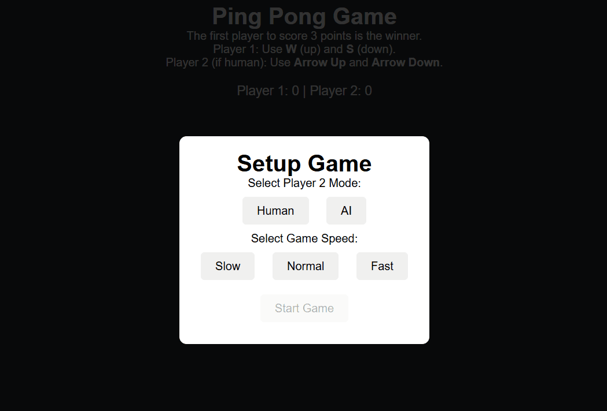

# Browser Ping Pong Game

This classic Ping Pong game was built in a browser using HTML, CSS, and JavaScript with the help of ChatGPT.

Thanks to GitHub Pages, the game can be played in the following link:
https://joacoleza.github.io/browser-ping-pong-game/

## How to Play:

The game allows you to play Ping Pong against another player or an AI. You can select the speed of the game (Slow, Normal, or Fast) and choose whether Player 2 is controlled by another human or by the AI.

- **Player 1 controls:** Use the "W" key to move up and the "S" key to move down.
- **Player 2 controls:** Player 2 can either be controlled by a human (use the Arrow keys to move up and down) or by AI.
- **Objective:** Score 3 points to win a game. The first player to win 3 games wins the match.

After each game, you will see the score displayed, and the game will reset for a new round.

## Features:

- Single-player or two-player mode.
- Selectable game speed (Slow, Normal, Fast).
- Intuitive controls for desktop.

## Gameplay

  

